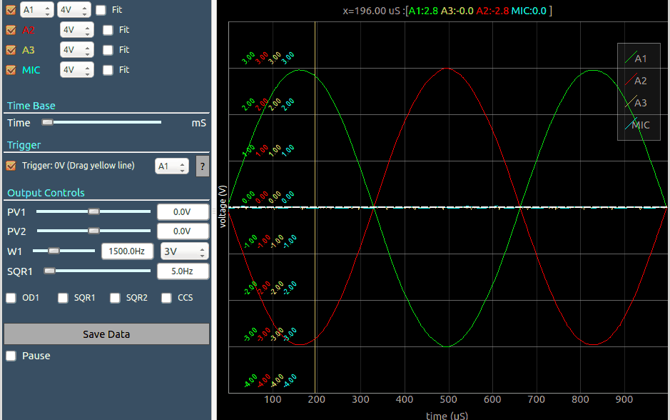

# ExpEYES17-Qt
Qt based toolkit for accessing [ExpEYES-17](http://expeyes.in)
### ExpEYES-17

### Screencast of the oscilloscope app

## Building from source for python2.7 with PyQt4

### Dependencies

+ On Debian/Ubuntu
  + sudo apt-get install python-pyqt4 , python-pyqtgraph, python-scipy, python-pyqt4.qtsvg, pyqt4-dev-tools, python-pyqt4.qtwebkit, python-serial
  + make

`python -m SPARK17.spark17`

## Building from source for python3 with PyQt5

### Installing Dependencies

+ On Debian/Ubuntu
  + sudo apt-get install python3-pyqt5 , python3-pyqtgraph, python3-scipy, python3-pyqt5.qtsvg, pyqt5-dev-tools, python3-pyqt5.qtwebkit, python3-serial
  + make QT_VERSION=PyQt5

`python3 -m SPARK17.spark17`

## Building from source for python2.7 with PySide

### Dependencies

+ Work in progress. Currently segfaults under various scenarios.
+ On Debian/Ubuntu
  + sudo apt-get install python-pyside , python-pyqtgraph, python-scipy, pyside-tools
  + make QT_VERSION=PySide

`python -m SPARK17.spark17`

## Granting Permissions to the USB port

+ Copying the rules file permanently
  + sudo ./postinst.sh
+ For temporary permissions
  + sudo chmod 666 /dev/ttyACM*
  + Launch the application `python -m SPARK17.spark17`

## Housekeeping

`make clean` wipes out all generated files and leaves only sources.

## Installer for 32-bit Windows
[Download Link](https://drive.google.com/file/d/0B-Zqgt0_c1zDdDIyOXl1WEdXWnc/view?usp=drive_web) for a 32-bit windows installer prepared on Windows 10 using Pyinstaller and InnoSetup . warning: this utility bundles python and associated dependencies into a single 80MB file that takes up 250MB on installation, but the dependencies and interpreter will not be available for using with other apps or simple python scripts. In order to install dependencies separately, please consider the following [README_WINDOWS](./README_WINDOWS.md)

## Bug reports
Please raise an issue on this repository

## Resources
+ [ExpEYES Website](http://expeyes.in/)

