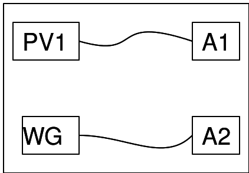

{: width="700px"}

## Instructions

Connect the wires  as shown in the figure.

Set PV1 to 2 volts. 

Graph of DC will be a horizontal line.

Now set W1 to 1000Hz. This means the voltage output from W1 will oscillate between 3V and -3V 1000 times every second.

From the graph, note the times when the voltage crosses 0 Volts in the upward direction.
 measure the time for one cycle and calculate the frequency from that. Verify that it is close to the set frequency.
 
 You may also use the 'fit' function by using the checkbox next to A2 in the controls section, and this will automatically derive a precise value of the frequency for you.
 

{: width="600px"}

