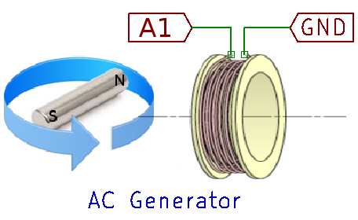
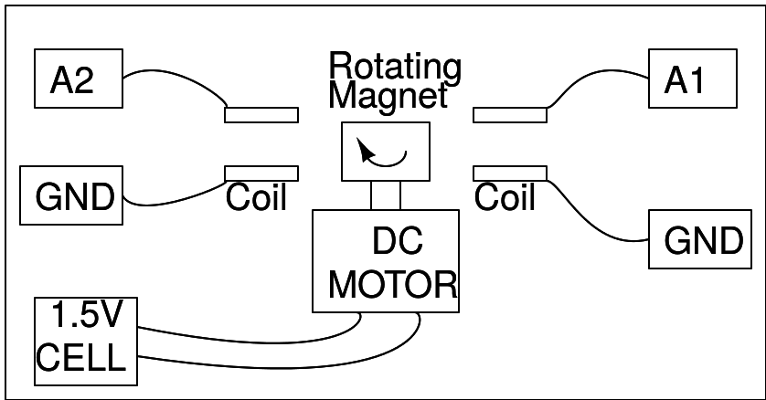

## Schematic A : Single phase
___

{: width="400px"}

- A magnet stuck on top of a rotating DC motor is used to create a changing magnetic field. Instead of the DC motor, you can also build any mechanical contraption such as a turbine to rotate the permanent magnet.

- A coil is placed near this rotating magnet the such that the magnetic flux passing through it continuously reverses its direction.

- The changing magnetic field induces a voltage that is recorded by A1. You can also enable the 'fit' button in order to calculate the frequency and amplitude of the signal. The frequency of the induced EMF will be the same as the rotation frequency of the magnet.

## Schematic B : Dual phase
___
{: width="400px"}

- In this instance , two coils are used. If they are placed diametrically opposite, the phase difference is 180 degrees.

- Try changing the angle between the coils, and note that the phase difference in the induced signals depends on it.
