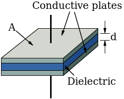

## Make your own parallel plate capacitor
___

## Schematic

{: width="400px"}

- Stick a square piece of aluminium tape on either side of a piece of butter paper. Ensure that the two plates do not touch each other along the edges, and are separated by the butter paper.

- Connect one plate to IN1, and the other to GND, and measure the capacitance.

- Now cut this capacitor along the center, such that the area is reduced by half, and measure capacitance again.

## Study how capacitors behave in combination 
___

- Measure the values of the capacitors by individually connecting them between CAP and GND, and note these.
##Schematic

{: width="400px"}

## In Parallel
___
## Schematic

{: width="400px"}

- Connect the two capacitors in parallel as shown below, and observe the combined capacitance. Ctotal = C1+C2.

## In Series
___
## Schematic

{: width="400px"}

- Now connect them in series, and measure the net capacitance

## Screenshot
___
{: width="300px"}



