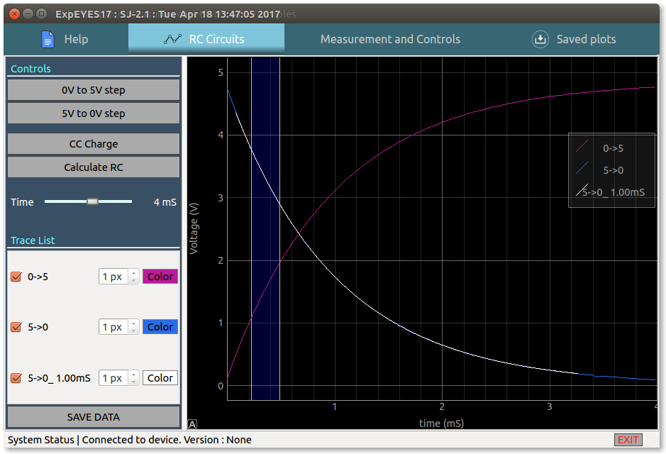
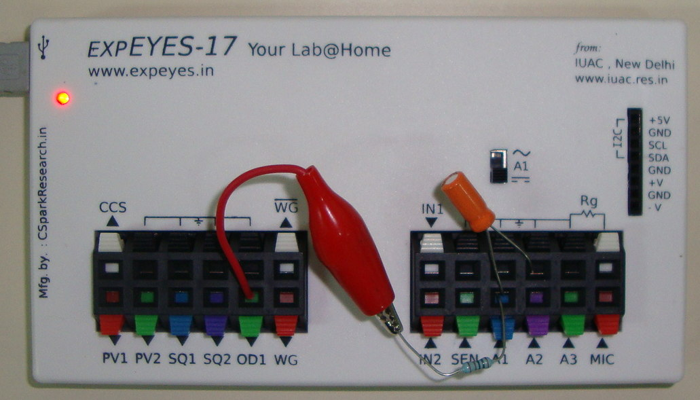

# Réponse transitoire, circuits RC

{: width="700px"}

## Les transitions de charge/décharge à tension constante suivantes peuvent être enregistrées à l'aide du schéma ci-dessus
+ échelon 0 - 5V : on décharge d'abord le condensateur en réglant OD1 à 0V, puis
  OD1 est réglé à 5V et la courbe de charge est enregistrée
+ échelon 5 - 0V : on charge d'abord le condensateur en réglant OD1 à 5V, puis
  OD1 est réglé à 0V et la courbe de décharge est enregistrée

## Caractéristique de charge à courant constant
+ Le condensateur est connecté entre CSS et GND, et la courbe de charge est enregistrée à l'aide du contrôleur interne de la source de courant.

{: width="700px"}

Un échelon de tension est appliqué à un circuit RC série et la tension aux
bornes du condensateur est enregistrée.

## Analyse

Tirer-glisser la région bleue en utilisant les poignées de chaque côté, puis
cliquer sur le bouton pour calculer le produit RC. La constante de temps RC des
dernières données enregistrées est calculée, et une nouvelle courbe est tracée
par-dessus les données originales.

## Photo du montage pour la charge à tension constante

{: width="700px"}
