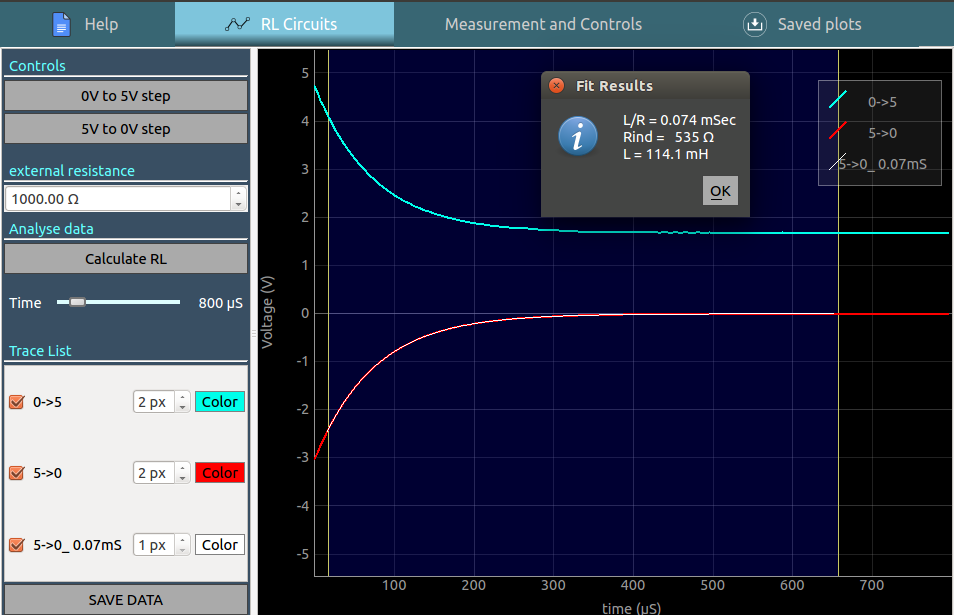

# Réponse transitoire, circuits RL

Un échelon de tension est appliqué à un circuit RL série et la tension aux
bornes du bobinage est enregistrée.

{: width="700px"}

## Les transitions de charge décharge suivantes peuvent être enregistrées avec le schéma ci-dessus
+ échelon 0 - 5V : d'abord, OD1 est réglé à 0V. Après un délai de stabilisation de 0,5 s, la sortie est réglée à 5V, et la réponse transitoire est enregistrée
+ échelon 5 - 0V : d'abord, OD1 est réglé à 5V. Après un délai de stabilisation de 0,5 s, la sortie est réglée à 0V, et la réponse transitoire est enregistrée

{: width="700px"}

## Analyse

Tirer-glisser la région bleue à l'aide des poignées de chaque côté, et cliquer
sur le bouton pour le calcul de RL. La constante de temps RL des dernières
données mesurées est calculée, et une nouvelle courbe est tracée par-dessus les
données originales

## Photo du montage

{: width="700px"}
