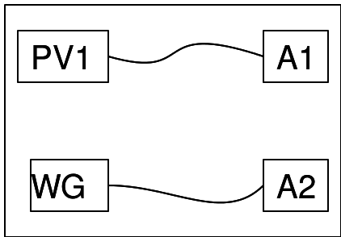

{: width="700px"}

## Instructions

Connecter les fils comme montré dans la figure.

Régler PV1 à 2V. 

Le graphique de la tension continue sera une ligne horizontale.

Puis régler W1 à 1000Hz. Ça signifie que la sortie de tension de W1 
va osciller entre 3V and -3V 1000 fois par seconde.

À partir du graphique, noter combien de fois la tension croise la 
valeur de 0V dans le sens montant.
 Mesurer la durée d'un cycle et calculer la fréquence à partir de là.
 Vérifier que c'est proche de la fréquence du réglage.
 
 On peut aussi utiliser la fonction « fit » en utilisant la case à
  cocher près de A2 dans la section de contrôle, ce qui fait calculer 
  automatiquement une valeur précise de fréquence.
 

{: width="600px"}

