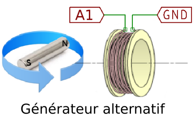

## Schéma A : simple phase

{: width="400px"}

On utilise un aimant placé sur un moteur électrique, en rotation, 
 pour créer un champ magnétique variable. À la place du moteur électrique,
 on peut aussi concevoir n'importe quelle construction mécanique
 comme une turbine pour entraîner la rotation de l'aimant permanent.

On place une bobine au voisinage de l'aimant tournant de telle façon
 que le flux qui la traverse change constamment de sens.
 
Le champ magnétique variable induit une tension qui est enregistrée par
 A1. On peut aussi activer le bouton « fit » afin de calculer la fréquence
 et l'amplitude du signal. La fréquence de la f.e.m. induite sera la
 même que la fréquence de rotation de l'aimant.

## Schéma B : double phase
{: width="400px"}

Dans ce cas, on utilise deux bobines. Si elles sont diamétralement
opposées, la différence de phase est de 180°.

On essaiera de changer l'angle entre les bobines, et on notera que
la différence de phase des signaux induits dépend de cet angle.
