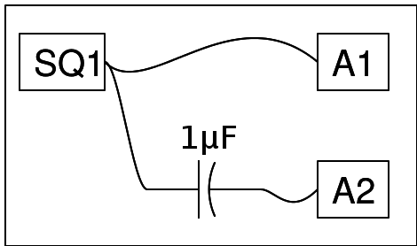

{: width="700px"}

## Instructions

La sortie de SQ1 varie entre 0 et 5 volt, comme le montre l'entrée A1.

Ça signifie que sa valeur moyenne est de 2,5 volt, ce qui est la composante continue.

Après passage à travers un condensateur la tension est changée en -2,5 à +2,5 volt, comme la partie continue est bloquée par le condensateur.

{: width="600px"}

