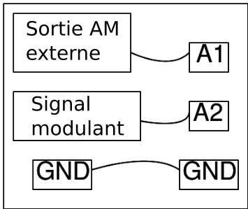

{: width="400px"}

## Instructions

On a besoin d'un signal en modulation d'amplitude externe pour faire cette expérience.

Le programme capture les données et il peut aussi montrer le spectre de puissance.

Les bandes latérales sont visibles dans le spectre d'un signal AM.

{: width="600px"}

