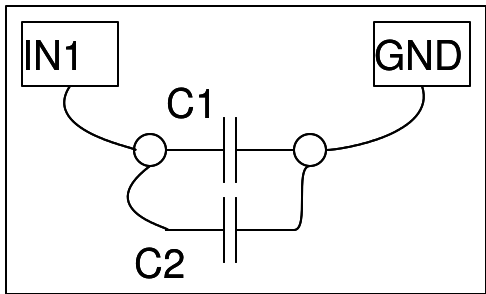
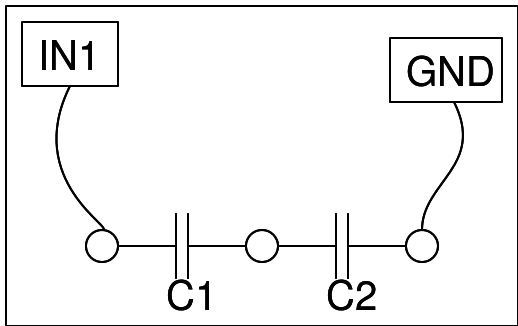

## Réalisation d'un condensateur plan

{: width="400px"}

Coller un morceau d'adhésif aluminium carré sur les deux faces d'un
papier d'emballage (ou papier de cuisson). S'assurer que les deux
plateaux ne sont pas en court-circuit en se touchant le long d'un bord,
et sont bien séparés par le papier d'emballage.

Connecter un plateau à IN1, l'autre à GND, et mesurer la capacité.

Ensuite couper ce condensateur en deux moitiés à peu près égales,
et mesurer la capacité à nouveau.

## Étude de l'association de condensateurs 

Mesurer les valaeurs des capacités en les connectant une par une
entre CAP et GND, et les prendre en note.

{: width="400px"}

## En parallèle

{: width="400px"}

Connecter les deux condensateurs en parallèle comme montré ci-dessous,
et observer la capacité de l'ensemble. Ctotal = C1 + C2.

## En série

{: width="400px"}

Ensuite les connecter en série, et mesurer la capacité.

## copie d'écran

{: width="300px"}



