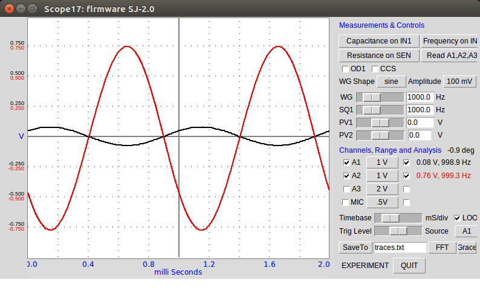
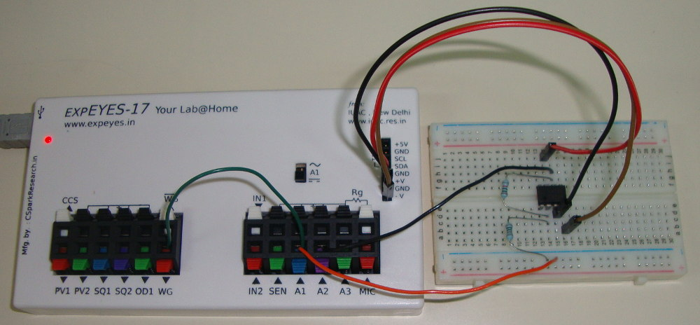
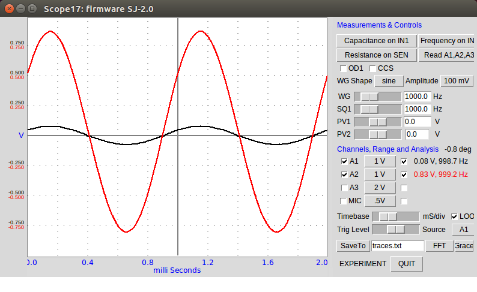
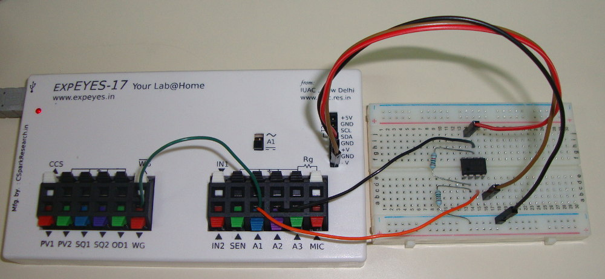
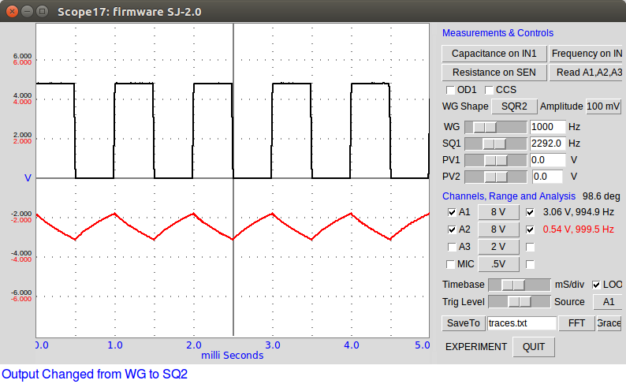
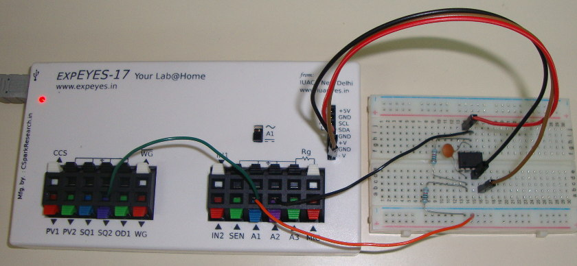
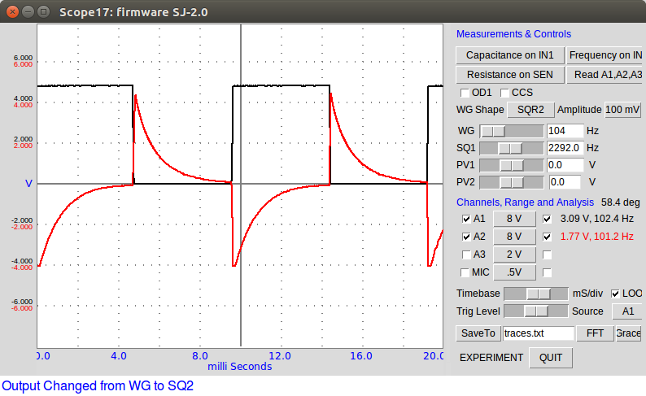
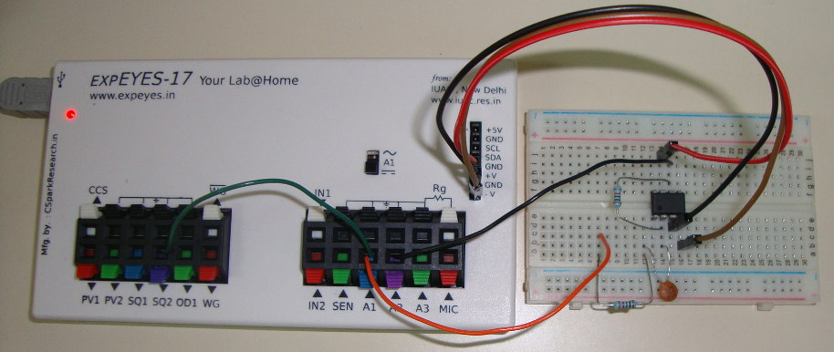

Circuits à amplis-ops
=====================
-----------------------

Avec le générateur BF intégré, l'oscilloscope et l'alimentation +/- 6V continue,
on peut étudier des circuits à amplis-ops jusqu'à une fréquence de 100 kHz.

L'amplitude de WG peut être réglée à 3 volt, 1 volt ou 80 mV.

Pour tester des circuits amplificateurs, régler l'amplitude à 80 mV.

Le signal d'entrée est surveillé par A1 et la sortie est connectée à A2.

Plusieurs exemples sont donnés ci-dessous.

Amplificateur inverseur
=======================
-------------------

	

		
		<h3 style="text-align:center;">Copie d'écran</h3>
	
		
	

		
		<h3 style="text-align:center;">Photo</h3>
	
		

	

		
		<h3 >Schéma</h3>
	
		

Amplificateur non-inverseur
===========================
-----------------------

	

		
		<h3 style="text-align:center;">Copie d'écran</h3>
	
		
	

		
		<h3 style="text-align:center;">Photo</h3>
	
		

	

		
		<h3 >Schéma</h3>
	
		

Intégrateur à ampli op :
========================
-----------------------

	

		
		<h3 style="text-align:center;">Copie d'écran</h3>
	
		
	

		
		<h3 style="text-align:center;">Photo</h3>
	
		

	

		
		<h3 >Schéma</h3>
	
		

Différentiateur à ampli op :
============================
-----------------------

	

		
		<h3 style="text-align:center;">Copie d'écran</h3>
	
		
	

		
		<h3 style="text-align:center;">Photo</h3>
	
		

	

		
		<h3 >Schéma</h3>
	
		

