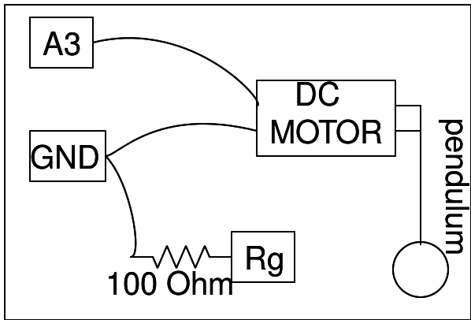

## Utilisation d'un moteur à courant continu comme capteur de vitesse

L'objet de cette expérience est de déterminer lapériode des oscillations d'un
pendule simple. Afin demesurer la vitesse des oscillations, on construit
le montage suivant :
* fixer un pendule à l'axe d'un moteurà courant continu
* Comme le moteur à courant continu consiste en une bobine au voisinage d'un
  aimant permanent, il se comporte aussi comme une dynamo quand l'axe est
  actionné par une cause externe
* On connecte les fils du moteur à A3 (un voltmètre à haute impédance) et à la
  masse GND
* Quand on déplace le pendule, une tension proportionnelle à sa vitesse est
  induite aux bornes des bobinages du moteur, par ce que la force électromotrice
  est proportionnel à la vitesse de changement du flux magnétique
* Le simple fait d'enregistrer cette tension en fonction du temps permet
  d'estimer la période ainsi que le coefficient d'amortissement, à l'aide des
  fonctions d'ajustement des données.

{: width="400px"}


