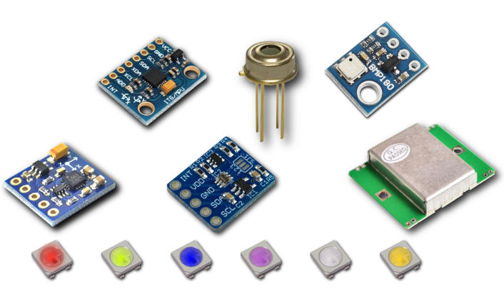
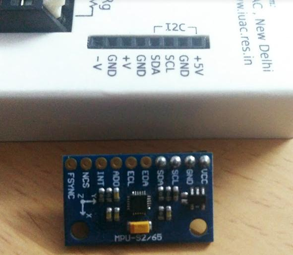
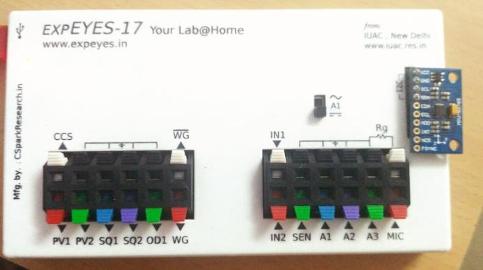

## Les capteurs I2C supportés par ExpEYES à ce jour

- MPU6050 : Accéléromètre 3axes, Gyromètre 3 axes
- MPU925x : Accéléromètre 3axes, Gyromètre 3 axes, - magnétomètre 3 axes activé séparément
- HMC5883L : Magnétomètre 3 axes avec calibres ajustables
- MLX90614 : Capteur de température à IR passif
- BMP180 : Module pour la pression, la température et l'altitude
- TSL2561 , BH1750 : Mesures d'éclairement jusqu'à 40 kLux
- SHT21 , Si7021 : Module pour la température d'ambiance et l'humidité

{: width="400px"}

## Connection d'un capteur I2C

{: width="400px"}

Les capteurs I2C nécessitent essentiellement quatre connexions
* Vcc : Alimentation positive. Vérifier la documentation du capteur pour la tension d'alimentation préconisée. ExpEYES fournit 5V sur le port I2C comme la plupart des capteurs commerciaux viennent avec un régulateur de tension intégré.
* GND : Terre / Moins de l'alimentation
* SCL : Signal d'horloge pour l'échange de données
* SDA : Ligne de données bidirectionnelle

Le capteur de l'image ci-dessus est le MPU925x, 
une unité de mesure inertielle "dix en un" capable de mesurer
l'accélération sur 3axes, la vitesse angulaire et lechamp magnétique.

## Détecter le branchement d'un capteur

* Dès qu'un capteur est branché, cliquer sur le bouton autoScan pour faire détecter les capteurs par l'appareil
* Si un capteur est détecté, etqu'il est aussi supporté par la bibliothèque Python ExpEYES, il mettra à jour automatiquement le menu avec un bouton pour ce capteur.
* Cliquer sur le nom du capteur détecté, et une série de graphiques sont automatiquement affichés dans la section `traces` et les légendes sont mises à jour.
* Sélectionner le nombre de points à enregistrer le long de l'axe X, et démarrer l'enregistreur de données.



{: width="700px"}
