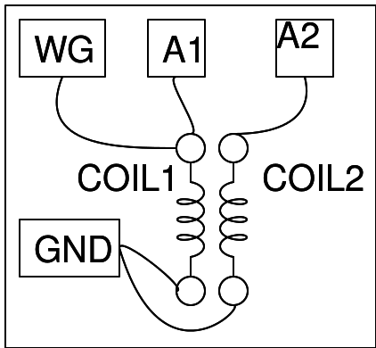
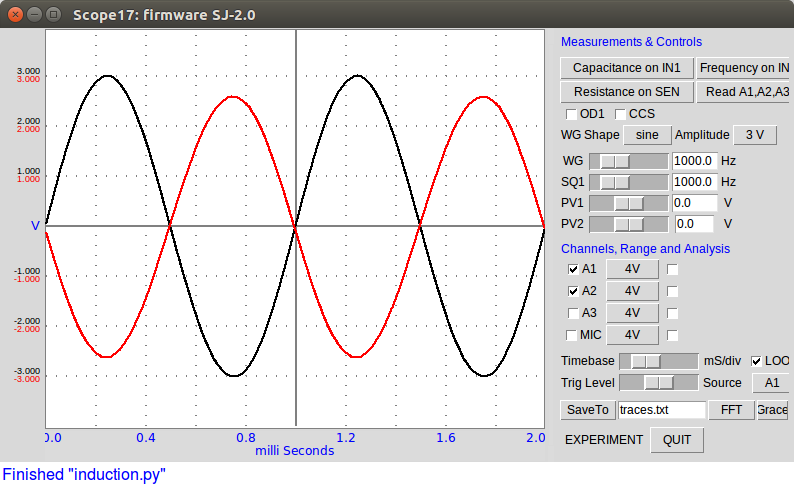
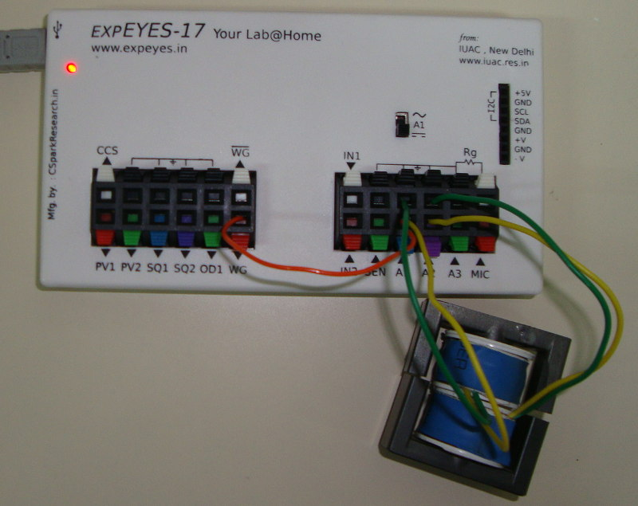

{: width="500px"}

On utilise les deux bobines fournies avec ExpEYES. Placer les bobines proches
l'une de l'autre et parallèles. L'une joue le rôle de primaire, elle est
connectée à W1, l'autre est le secondaire, et on surveille la tension induite
à ses bornes.

Insérer un matériau ferromagnétique dans l'axe des bobines pour augmenter la
tension induite dans la bobine secondaire.

{: width="500px"}
{: width="500px"}

