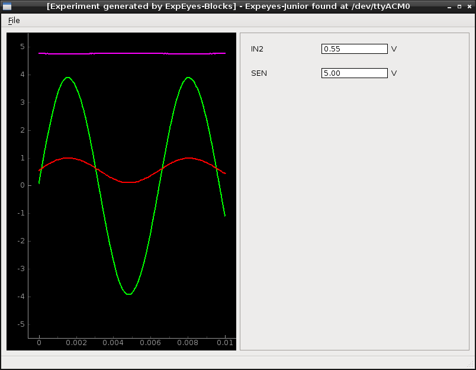

# Expeyes-Blocks #

This is a utility for quick prototyping new applications
for ExpEYES.

Take symbols from the left-hand list, drag them to the working area,
connect them at their snap points, customize their properties (Right
click should open a contextual dialog), then save the working area and
compile it to a working prototype for ExpEYES (currently Expeyes-Junior
and Expeyes-17 are targetted, however only the first in taken in account
so far).

Blocks looking like squares should be used to build applications which
require no oscilloscope display.

There is a block looking like an oscilloscope screen, to build applications
with such a display. This one is effective: one can build a working
application out of it, however the code is roughly
"alpha quality" so far.

## Begin with an example ##

You can launch `python Expeyes-Blocks.py sample.eyeblk`.

The shortcut `F5` launches a compilation and runs a simple application
with Qt widgets, which features a scope display, and voltage inputs
wired to channels 1..4 as expected. So far, it has been tested with
Expeyes-Junior.

For the snaphot above, the `SINE` output was wired to `A1` and the
`SEN` input was not wired (so its voltage is near 5V, due to its
pullup resistor).

With some more work, we should be able to control and add nice features, like
widgets to modifiy the sampling rate, save the results to a file, launch a
general-purpose data analysis tool, get an FFT transform, and so on.
