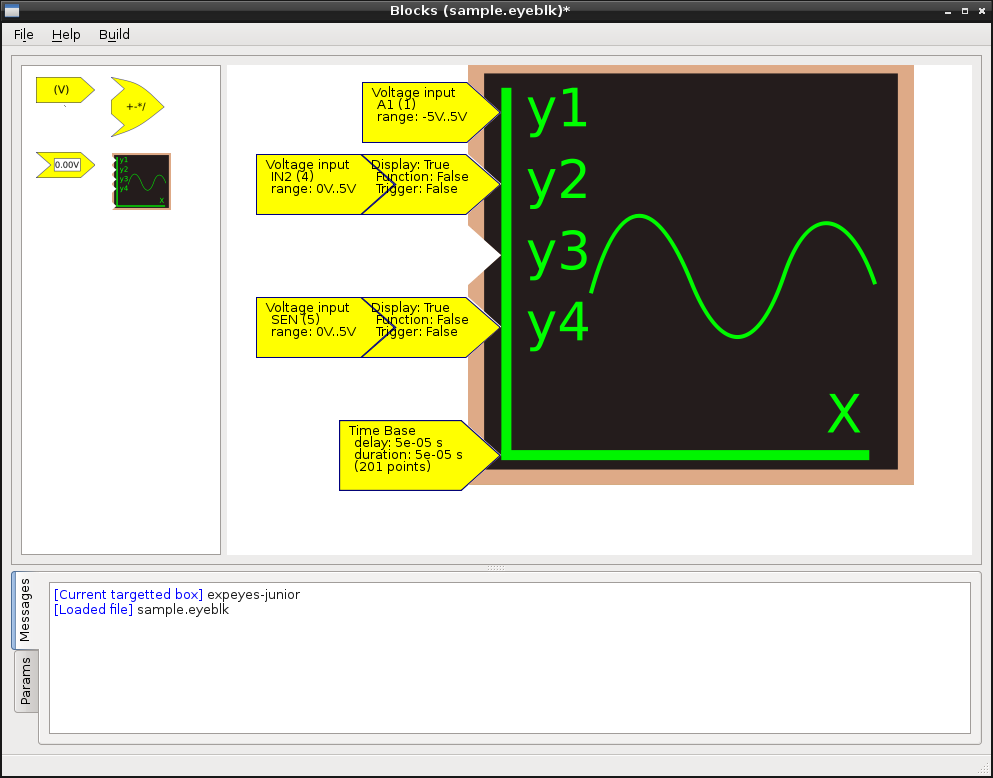

# Expeyes-Blocks #

This is a utility for quick prototyping new applications
for ExpEYES.

Take symbols from the lest-hand list, drag them to the working area,
connect them at their snap points, customize their properties (Right
click should open a contextual dialog), then save the working area and
compile it to a working prototype for ExpEYES (more than one device
model is targetted).

## Begin with an example ##

You can launch `python blocks.py sample.eyeblk`.
